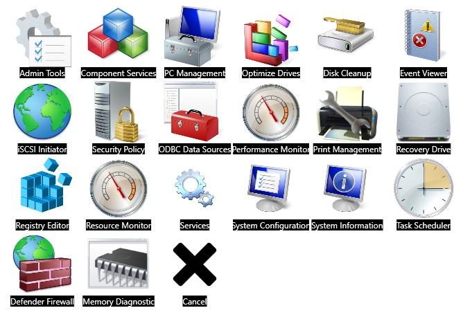

# ShortcutsGrid
WPF desktop app that displays 'custom list' grid with links to other programs on the  PC. (+ more options)

My insparation for making this was that Windows 11 start menu doesn't have the grouping apps option. And I start thinking of better way to sort my installed apps so I can access them faster.

	control|Control Panel|iVBORw0KGgoAAAA...
	control|Control Panel|C:\Images\Control-Panel-128.png
	control|Control Panel|Control-Panel-128.png
