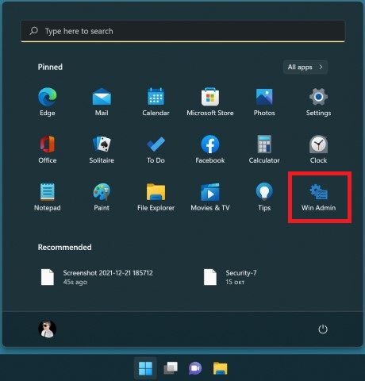

# ShortcutsGrid
WPF desktop app that displays 'custom list' grid with links to other programs on the  PC. (+ more options)

My insparation for making this was that Windows 11 start menu doesn't have the grouping apps option. And I start thinking of better way to sort my installed apps so I can access them faster.

  
[Download this example](./examples/Administrative-Tools.zip)

#### It consist of 2 files:
* exe (show in the screenshots)
* text file (customizable list with programs' path)

To work both files should be in the same folder and have the same names. (it can be seen in the examples)

#### Text file types:
* csv
* json - (to be done in the future)

#### Text file structure:
Every row is one program. It has 3 parameters divided with '|':
* command or file path
* name to display under the program's icon
* image to display (not required) - if left black it'll try to get icon from exe's path; custom image can be assian by path or base64 string

It supports run commands!

It has custom command that this app checks for: 'run' - it displays run dialog.

#### Example:

	control|Control Panel|iVBORw0KGgoAAAA...
	control|Control Panel|C:\Images\Control-Panel-128.png
	control|Control Panel|Control-Panel-128.png

...more coming...