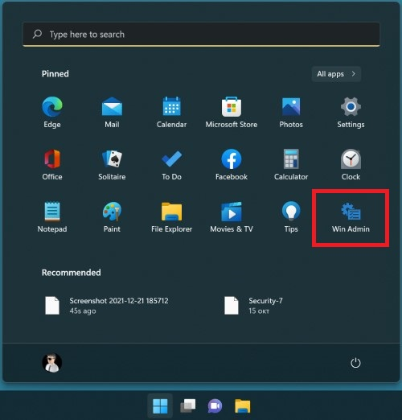
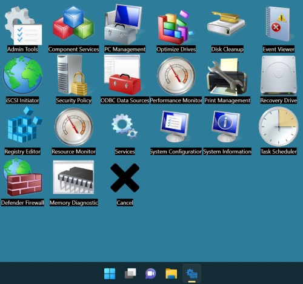

# Shortcuts Grid

[](https://github.com/minkostaev/ShortcutsGrid/actions/workflows/dotnet-desktop.yml)
[](https://github.com/minkostaev/ShortcutsGrid/actions/workflows/dotnet-desktop.yml)

[](https://github.com/minkostaev/ShortcutsGrid/commits/)
[](https://github.com/minkostaev/ShortcutsGrid/releases)

**WPF (.NET 9.0) desktop app with transparent background that displays 'custom list' grid with links or commands to other programs on the PC to run. With customizable app names and icons/images.**

What you can use it for:
* Create your list with programs' **shortucs** for easy and fast way to start them
* Create your list with **run commands** for easy and fast way to start them
* Combination of both

*Basically it looks something like this:*

  

The idea is this exe to display user's group of apps. Copy or build new exe with different name and icon for other group of apps.

Each icon/app in the displayed grid on selection opens the selected app. But it also has **context menu** (right mouse click) with more options such as:

* Open (selected app without closing this app)
* Run as administrator
* Open folder of selected app
* Open folder of selected image
* Open folder of this app

*It supports double click and also ctrl+left click*

## User defined list with shortcuts

To display the shortcuts grid this app requires a **text file** placed next to build of it.

This text file is customizable list with **programs' path** or/and **run commands**.

**In order too work - the text file should be placed in the same folder as this app's exe and have the same names.** [(it can be seen in the examples)](examples)

The text file can be [csv](#csv-structure) **or** [json](#json-structure)

## Guide - how should the text file look like:

### Text file structure: list with objects - each object with 3 parameters:

1. run command or file path (it can have argument after the command/path)
2. name to display under the program's icon
3. image to display (not required) - if left black it'll try to get icon from exe's path; custom image can be assign by path or base64 string

### Text file types supported:

* [csv](#csv-structure) (default choice)
* [json](#json-structure)

---

### CSV structure:

Every 3 rows are 1 icon

1. Name to display under the program's icon
2. Path, folder or command
3. Image to display from path or base64 string

### Example with 2 'icons'

```
Control Panel
C:\Windows\System32\control.exe
iVBORw0KGgoAAAA...
Devices & Printers
control printers
C:\Images\Control-Printer-128.png

```

*If it has 3 empty rows it'll adds empty slot.*

---

### JSON structure:

ExePath is app's path or run command (it can have argument after it)
AppName is app's label
ImgPath is custom image to display - path or base64 string

```
[
	{
		"ExePath": "C:\Windows\System32\control.exe",
		"AppName": "Control Panel",
		"ImgPath": ""
	},
	{
		"ExePath": null,
		"AppName": null,
		"ImgPath": null
	},
	{
		"ExePath": "C:\Windows\System32\control.exe",
		"AppName": "Control Panel",
		"ImgPath": "iVBORw0KGgoAAAA..."
	},
	{
		"ExePath": "control",
		"AppName": "Control Panel",
		"ImgPath": "C:\Images\Control-Panel-128.png"
	},
	{
		"ExePath": "control printers",
		"AppName": "Devices & Printers",
		"ImgPath": "Control-Printers-128.png"
	}
]
```

*If it has a object with only 'null' fields it adds empty slot.*

